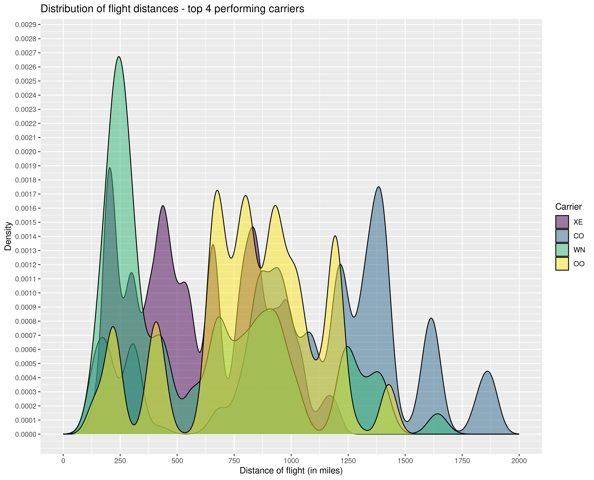
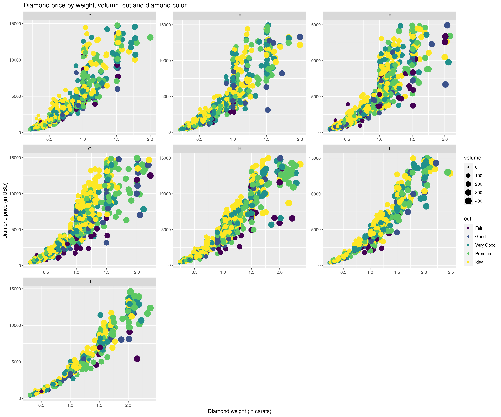
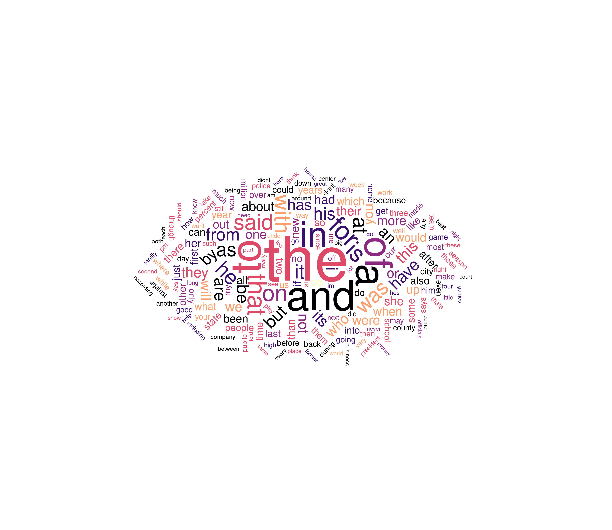
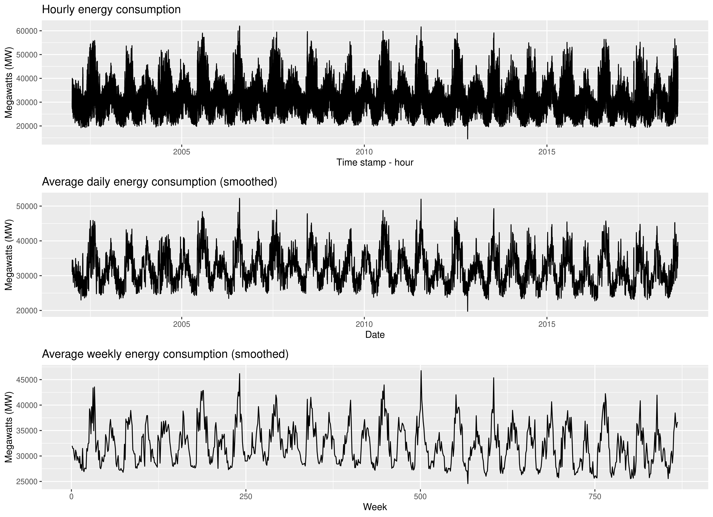

# V Data Visualize: ggplot2

## Assignment
Create R script for each exercise. In this assignment we will test our ggplot2 skills!

### Exercise 1
* In the first exercise try to re-create plot as seen below. Some guidelines:
	* use hflights data set
	*  find top 4 carriers (total number of flights)
	* draw density plot for variable ”distance”
	* each carrier has its own density curve
	* fill density area with different colors
	* scale fill colors with ”Viridis” color palette
	* all densities are drawn in the same plot
	* use transparency for fill colors
	* remove the outliers: distance < 2000
	* use theme minimal
	* you can tweak some theme parameters (seen from the plot)
	* export your final plot

### Exercise 2
* In the second exercise we will create plot as seen in Diamonds.png. Some guidelines:
	* use diamonds data set (from ggplot2)
	* randomly select 10000 diamonds
	* create new variable volume = x ∗ y ∗ z
	* now keep only diamonds with:
		* carat < 2.5 and
		* price < 15000 and
		* volume < 600
	* use your data to create scatter plot
	* on x axis put ”carat”
	* on y axis put ”price”
	* size of the dots is represented with ”volume”
	* for color of the dots use diamond ”cut”
	* create facets using facet wrap and diamond ”color”
	* you can tweak some theme parameters (seen from the plot)
	* export your final plot

### Exercise 3
* In this exercise we will create a word cloud (wordscloud.png). The guidelines are:
	* use corpus.txt - data set from the assignment 3
	* clean the corpus (as we did before)
	* prepare a table called ”corpus.words” (as we did before)
	* keep only 200 most frequent words
	* now use table ”corpus.words” to draw word cloud
	* each word is shown on the word cloud
	* ”count” frequency represents the size of the word on word cloud
	* words are put into different groups based on the first letter in the word:
		* group a first letters: ”a” ”b” ”c” ”d” ”e”
		* group b first letters: ”f” ”g” ”h” ”i” ”j”
		* group c first letters: ”k” ”l” ”m” ”n” ”o”
		* group d first letters: ”p” ”q” ”r” ”s” ”t”
		* group e first letters: ”u” ”v” ”w” ”x” ”y” ”z”
		* group f for all other characters!
	* use groups for word colors
	* export your final plot

### Exercise 4
* In the fourth exercise we will create plot as seen in energy\_consumption\_time\_series.png. Some guidelines:
	* use pjm hourly est.csv - data set from the assignment 4
	* we will draw time series for
		* hourly energy consumption
		* daily averages energy consumption
		* weekly averages energy consumption
	* create three time series sub plots with cowplot
	* additional you can tweak some theme parameters (seen from the plot)
	* export your final plot

