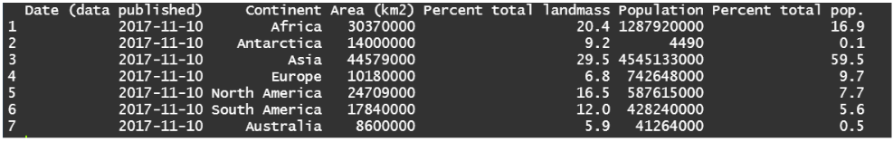

# About tibble and readr

## tibble
tibble is a user-friendly way to handle data in R. When you use it, only a few rows show up on the screen, which is handy when dealing with big datasets. It also plays well with other tidyverse tools like dplyr for easy data manipulation.

## readr
readr is like a superhero for reading data in R. Its functions, such as read_csv() and read_table(), work faster than the basic R ones. They're smart too—they figure out the types of your data columns on their own. This makes bringing in data way simpler and quicker.
Together, tibble and readr team up to make handling and reading data in R a breeze!

# II Data Import (readr & tibble)
## Assignment
Create R script for each exercise. From course sources download zip file called data import.zip, extract its content in your data folder inside your R’s project folder.

### Exercise 1
* In this exercise you will create a tibble called continents, using data from the table shown on Figure 1. After you have created a tibble use it to calculate given table summaries:
	* total area
	* total population
	* sum of percentage - total landmass
	* sum of percentage - total population

Figure 1: Table - Continents

### Exercise 2
* In this exercise you will import .csv file called flights 02.csv, which is located in zip file. When you are importing the file, try to consider the following:
	* assign imported object to R object named df2
	* for importing use function from library readr
	* inside function for importing, define column parsing
	* maybe you should inspect the .csv file before actual import
	* after the import, check structure of df2 object with str()

### Exercise 3
* Now you will import .csv file called flights 03.csv. When you are importing the file, you should consider the following:
	* assign imported object to R object named df3
	* for importing use function from library readr
	* inspect the .csv file before actual import
	* function for import should include some additional import strategies (compared to previous example!)
	* HINT: at the point of import: maybe you should parse all columns as characters (col types = cols(.default = ”c”))
	* HINT: then inside R you can convert column types and add column names, after the import operation is executed
	* after the import, check structure of df3 object with str()

### Exercise 4
* In the last exercise you will import .csv file called flights 04.csv, which is a larger flat file with several million rows:
	* import file two times using readr library and data.table’s fread
	* when importing with readr do column parsing at the point of import
	* when importing with fread force all columns to be parsed as characters (colClasses = ”character”)
	* compare execution times for each importing strategy
